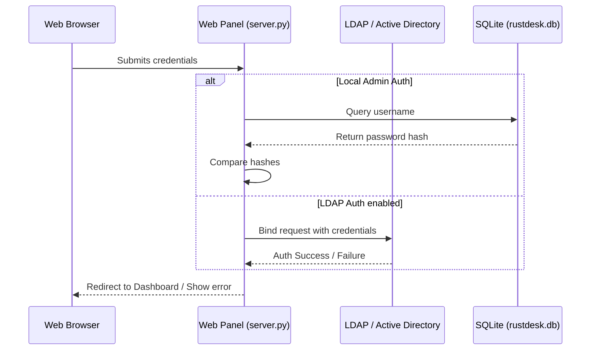

# Data Flow Documentation

## 1. Authentication Flow

## 2. Device Registration and Status Monitoring
1. **Heartbeat**: RustDesk client periodically sends a heartbeat payload containing hostname, current username, OS info, local IP, and client version to `hbbs`.
2. **Persistence**: `hbbs` writes the connection status, last seen timestamp, and IP coordinates to `rustdesk.db`.
3. **Rendering**:
   - The user opens the Web Panel.
   - `server.py` queries `rustdesk.db` for all devices.
   - For each device, `server.py` checks if `last_seen` is under 30 seconds ago to flag it as "Online".
   - Devices table is populated and sorted by last seen date using jQuery DataTables.
